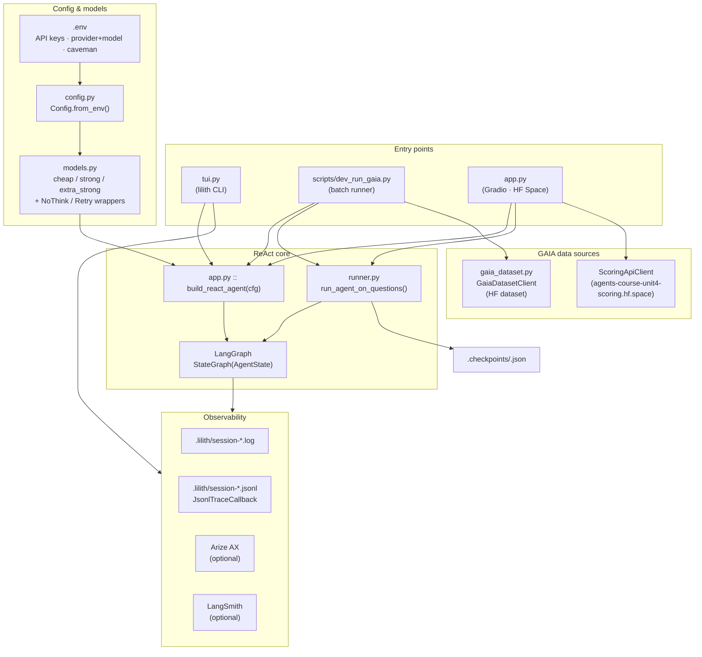
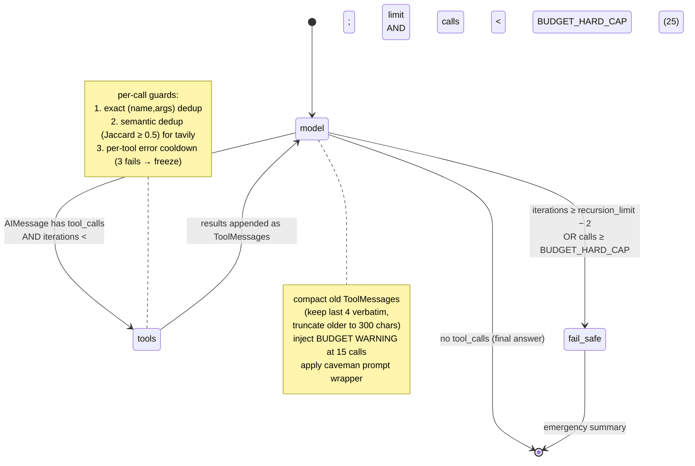
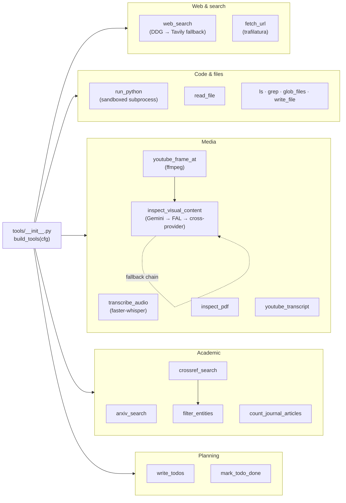

# Lilith Agent — Architecture

Three views: **system** (entry → graph → outputs), **ReAct graph** (state machine), **tool belt** (tool taxonomy + dependencies).

## System overview

## ReAct graph (state machine)

## Tool belt

## Key sources

| Concern | File |
|---|---|
| ReAct graph + routing + dedup | [src/lilith_agent/app.py](src/lilith_agent/app.py) |
| Batch runner + checkpoints | [src/lilith_agent/runner.py](src/lilith_agent/runner.py) |
| Config loader | [src/lilith_agent/config.py](src/lilith_agent/config.py) |
| Model provider factory | [src/lilith_agent/models.py](src/lilith_agent/models.py) |
| Tool registry | [src/lilith_agent/tools/__init__.py](src/lilith_agent/tools/__init__.py) |
| Logging + Arize + JSONL trace | [src/lilith_agent/observability.py](src/lilith_agent/observability.py) |
| HF dataset client | [src/lilith_agent/gaia_dataset.py](src/lilith_agent/gaia_dataset.py) |
| Gradio Space entry | [app.py](app.py) |
| Interactive TUI | [src/lilith_agent/tui.py](src/lilith_agent/tui.py) |
| GAIA batch CLI | [scripts/dev_run_gaia.py](scripts/dev_run_gaia.py) |
